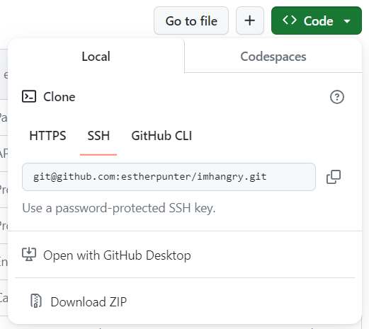
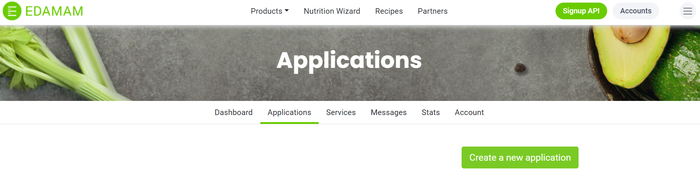
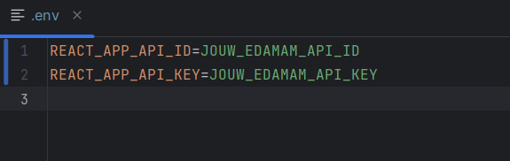

# **Handleiding**

## **Inleiding**
Het doel van de applicatie is om de dagelijkse moeite van het bedenken van een lekker recept weg te nemen. Men is bewust van het belang van het eten van een gevarieerd dieet, maar in het dagelijks leven kan dit soms nogal wat stress meebrengen. I’m Hangry helpt gebruikers om een keuze te maken en hierbij rekening te houden met hun humeur, tijd en andere behoeften.

Zo kan je direct op de homepagina een paar grappige vragen beantwoorden over hoe je je voelt, hoeveel tijd je hebt, en hoeveel zin je hebt om te komen. De applicatie laat je vervolgens passende recepten zien. Daarnaast kunnen gebruikers de applicatie ook gebruiken om door een grote database van recepten te browsen als ze al een idee hebben over wat ze willen koken. Verder kunnen gebruikers door middel van de zoekfunctie ook op zoek naar gerechten met specifieke ingrediënten, en bestaat er de optie om op specifieke ingrediënten te filteren (voor als je die bijna-rotte tomaat uit je koelkast nog heel graag wil gebruiken in een recept). Ten slotte is het voor gebruikers mogelijk om zich te registreren en inloggen en hun favoriete recepten te bekijken op hun profielpagina.

Volg de volgende stappen om de applicatie op je lokale computer te installeren.

## **Vereisten:**

Zorg ervoor dat je de volgende software hebt geïnstalleerd op je computer (zie bij 'Project installeren' hoe je dat kunt doen):

- node.js (https://nodejs.org/en/): JavaScript runtime
- npm (https://www.npmjs.com/): Node.js package manager
- Axios
- React Router
- dotenv
- JWT-decode

## **Handleiding instructies:**
### **Project clonen:**

De link naar de git hub repository: https://github.com/estherpunter/imhangry

1. Kopieer de url van het project

2. Open Webstorm en maak een nieuw Project aan via Version Control
3. Plaats hier de url en klik op 'Clone'
4. Zorg dat je het Project ontkoppeld van de bestaande GitHub repository door in de terminal 'git remote remove origin'
5. Vervolgens maak je een nieuwe repository aan op GitHub en koppel deze met het Project (vergeet deze niet te pushen!)

### **Project installeren:**

1. Installeer de dependencies in de terminal met de volgende commandos: 
   - npm install 
   - npm install axios
   - npm install react-router-dom
   - npm install dotenv
   - npm install jwt-decode

### **Project starten:**

1. Start het project in de terminal met 'npm run dev'
2. Open de applicatie door in de terminal op de link (http://localhost:5173/) te klikken

### **API Keys Instellen:** 

1. Ga naar de Edamam API-website en maak een account aan
2. Nadat je bent aangemeld, kan je een nieuwe applicatie aanmaken

3. Hier kan je de 'app_id' en 'app_key' verkrijgen
4. Maak een .env-bestand aan in de hoofdmap van het project
5. Voeg de 'app_id' en 'app_key' toe aan het .env-bestand 

Gefeliciteerd! Je hebt succesvol het I'm Hangry project geïnstalleerd en gestart!

## **Beschikbare inloggegevens:**

Er bestaan al gebruikers met de volgende inloggegevens:
- Username: gerrit
- Password: gerrit

- Username: piet
- Password: 123456